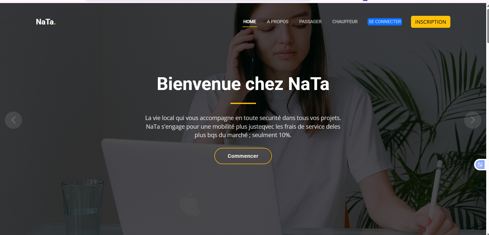
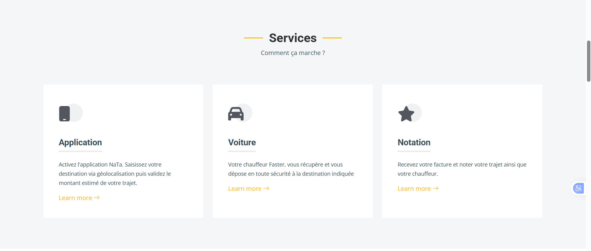
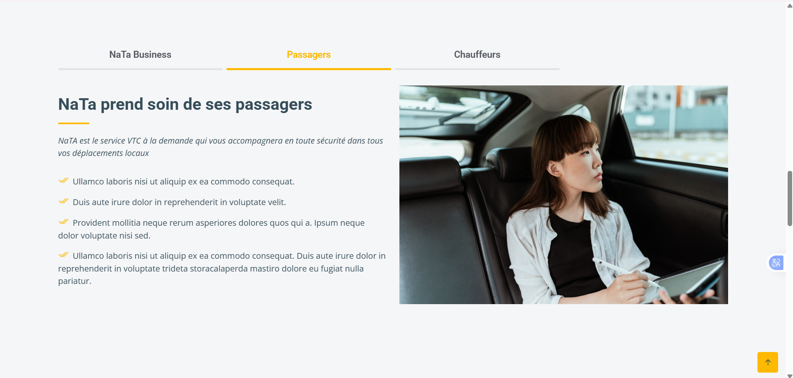
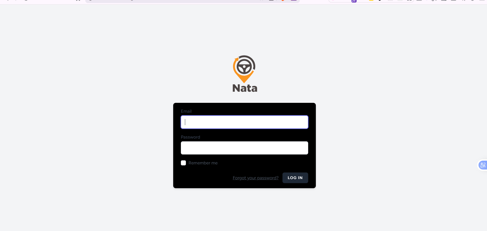
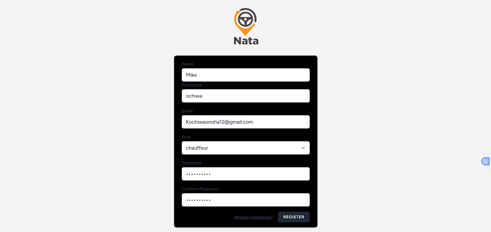
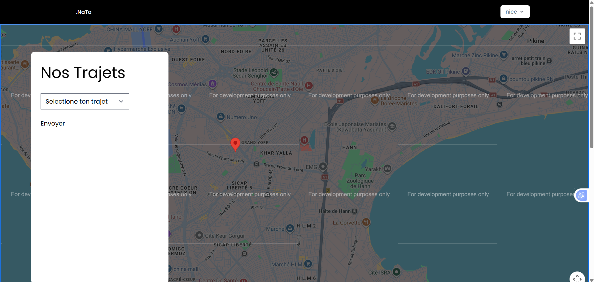

# 🚀 Projet Laravel 10 – Authentification & Dashboards

## 📚 Contexte

Ce projet a été réalisé en **2023** dans le cadre d’un **projet académique** visant à apprendre et maîtriser le framework **Laravel 10**.

L’objectif principal était de mettre en place un système **d’authentification sécurisé** et de gérer **plusieurs dashboards** selon le type d’utilisateur, tout en intégrant un **template HTML/CSS existant**.

---

## 🎯 Objectifs du projet

* Mettre en place une authentification complète
* Gérer plusieurs dashboards (selon les rôles)
* Intégrer un template HTML/CSS dans Laravel
* Structurer correctement un projet Laravel 10

---

## ⚙️ Fonctionnalités

* 🔐 Authentification (login, register, logout)
* 👤 Gestion de deux dashboards :

  * Dashboard chauffeur 
  * Dashboard Utilisateur
* 🧩 Séparation des vues selon le rôle
* 🎨 Intégration d’un template HTML/CSS
* 📱 Interface responsive

---

## 🛠️ Technologies utilisées

* **Laravel 10**
* **Laravel Breeze** (authentification)
* **PHP 8+**
* **HTML5**
* **CSS3**
* **JavaScript**
* **Bootstrap / Template HTML**
* **MySQL**

---

## 🖼️ Captures d’écran

Les captures d’écran du projet se trouvent dans le dossier suivant :

```
/screenshot
```

Aperçu des écrans :













---

## 🚀 Installation et lancement du projet

1. Cloner le projet

```bash
git clone <url-du-projet>
```

2. Installer les dépendances

```bash
composer install
npm install && npm run dev
```

3. Copier le fichier d’environnement

```bash
cp .env.example .env
```

4. Générer la clé de l’application

```bash
php artisan key:generate
```

5. Configurer la base de données dans le fichier `.env`

6. Lancer les migrations

```bash
php artisan migrate
```

7. Démarrer le serveur

```bash
php artisan serve
```

---

## 📌 Remarques

* L’authentification est gérée avec **Laravel Breeze**
* Les dashboards sont accessibles selon le rôle de l’utilisateur
* Le template HTML/CSS a été adapté pour fonctionner avec les vues Blade

---

## 👨‍🎓 Auteur

Projet réalisé par **Billet**
Projet académique – Laravel 10
Année : **2023**

---

✅ Projet réalisé dans un cadre pédagogique pour l’apprentissage de Laravel.
